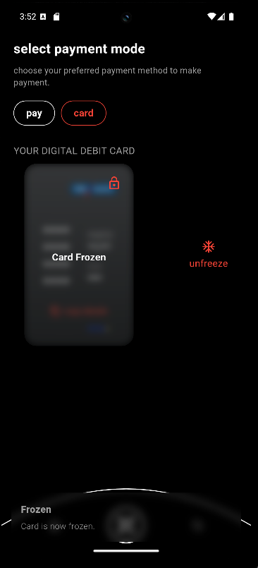
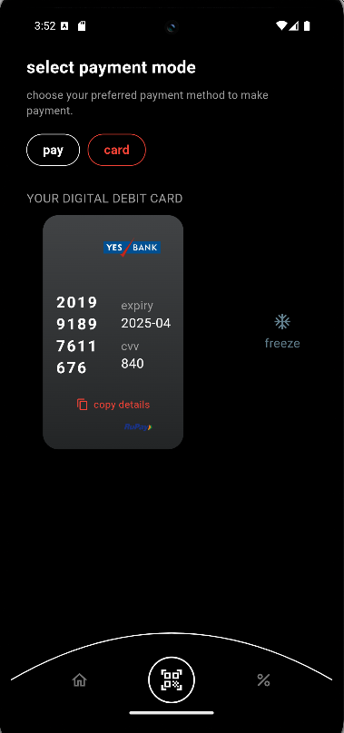

# ❄️ Freeze - YOLO

A beautifully crafted Flutter application to manage and display digital debit cards with freeze/unfreeze functionality and modern UI design.

## 📱 Features

- 🧊 **Freeze / Unfreeze Cards** – Easily toggle the visibility of card details.
- 💳 **Digital Debit Card UI** – Elegant card UI with blur effect when frozen.
- 📦 **Mock API Integration** – Fetch card data using mockaroo.
- 📋 **Copy to Clipboard** – Securely copy card details.
- ⚙️ **GetX Integration** – For fast and reactive UI updates.
- 🌐 **HTTP Package** – For fetching card data from APIs.
- 🎨 **Responsive UI** – Clean and modern layout with dark theme.

## 🔧 Tech Stack

- **Flutter**
- **Dart**
- **GetX**
- **HTTP**
- **Flutter Launcher Icons**
- **Convex Bottom Bar**
- **Google Fonts**
- **Faker (for placeholder data)**

## 🧪 Screenshots

| Frozen Card                   | Unfrozen Card                   |
|-------------------------------|---------------------------------|
|  |  |

> Add your real screenshots in the `/assets` folder and replace the names above.

## 🚀 Getting Started

### Prerequisites

- Flutter SDK
- Android Studio / VS Code
- Internet connection (for fetching data from API)

### Installation

```bash
git clone https://github.com/your-username/freeze.git
cd freeze
flutter pub get
flutter run
